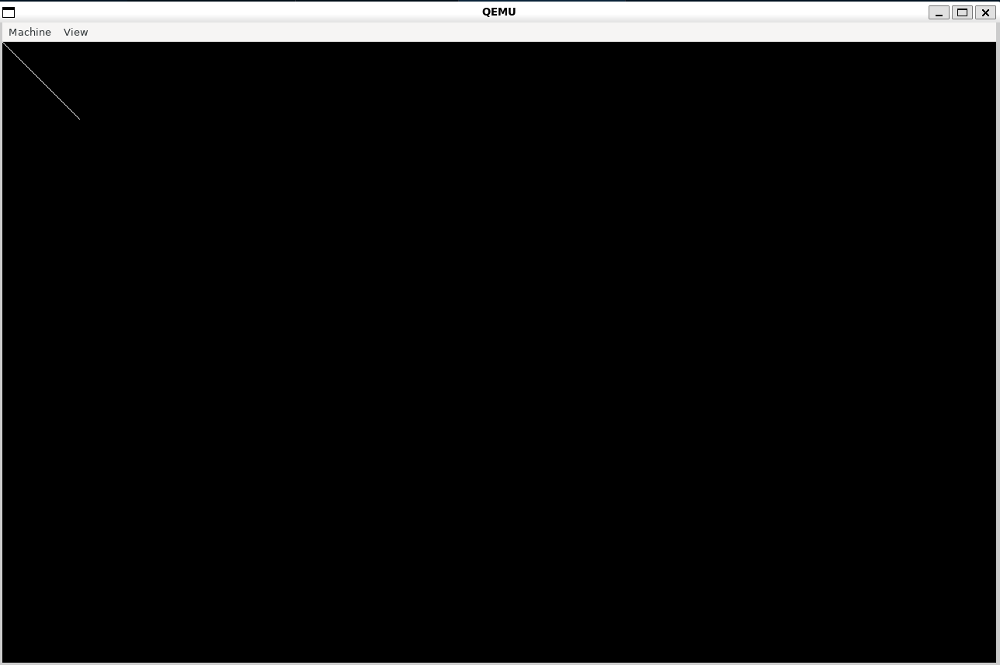

+++ 
author = "Liam Greenway" 
title = "Make a simple x86_64 limine kernel in C" 
date = "2025-04-11" 
description = "Create a simple kernel using the limine bootloader in C." 
categories = [ "Beginner" ] 
tags = [ "c", "limine" ] 
+++

In this tutorial, we will be creating a simple kernel using the limine bootloader in C.
This tutorial is based on the [Limine Bare Bones](https://wiki.osdev.org/Limine_Bare_Bones) tutorial.
This tutorial assumes you are running on linux.

You will need the following things

- git
- xorriso
- make
- qemu

You should know

- The C Programming Language
- How to use GCC
- How to use Git
- How to use a Makefile

## An x86_64 Cross Compiler

Even though the hardware to run your kernel exists, the software does not understand the specificities of building for your kernel specifically. The gcc you have installed on your computer is designed to build programs for your operating system specifically. To resolve this, we need to build a **cross compiler**. A cross compiler can be used to compile for something other than the machine you are running it on. You will almost always run into problems if you don't use a cross compiler.

You will not be able to compile your operating system *correctly* without a cross compiler.

The easiest way to setup an x86_64-elf-gcc cross compiler on linux is with *homebrew*. To install homebrew, run the following command

```bash
/bin/bash -c "$(curl -fsSL https://raw.githubusercontent.com/Homebrew/install/HEAD/install.sh)"
```

Afterwards run `brew install x86_64-elf-gcc` to install the cross compiler.

## Overview

Now that you have a cross compiler, you can start working on the kernel. This tutorial is a minimal OS kernel. It does not serve as a full kernel. It lacks several features of an operating system kernel, such as loading and executing programs, and does not output anything of use, other than to test the kernel's functionality. This does however, serve as a starter for further expansion. To start, create a directory for your kernel to reside in, and create the following structure, with any files being empty execpt for limine.h. You can get limine.h [here](https://github.com/limine-bootloader/limine/blob/v9.x/limine.h).

```tree
.
├── src/
│   ├── kmain.c
│   └── limine.h
├── Makefile
├── linker.ld
└── limine.conf
```

## Writing the kernel

First, include the limine header at the top of `kmain.c`, along with some utilities

```c
#include <stdbool.h>
#include <limine.h>
```

Next, add the limine header revision to the file. The `LIMINE_BASE_REVISION(3)` macro specifies the revision of the Limine bootloader that your kernel is compatible with. Ensure that your `limine.h` file includes the definition for this macro. If it is missing, you can define it as follows:

```c
__attribute__((used, section(".limine_requests")))
static volatile LIMINE_BASE_REVISION(3);
```

The `__attribute__` is telling the compiler that the variable is used. This has to be specified so that the compiler doesn't dispose of it during optimization. We also ask gcc to place it in the `.limine_requests` section.

Next, we add the framebuffer request to the file

```c
__attribute__((used, section(".limine_requests")))
static volatile struct limine_framebuffer_request framebuffer_request = {
    .id = LIMINE_FRAMEBUFFER_REQUEST,
    .revision = 0
};
```

This tells the limine bootloader to return a framebuffer that we can use to display graphics.

Next, we add the requests start and end markers. These tell the limine where the requests start and end.

```c
__attribute__((used, section(".limine_requests_start")))
static volatile LIMINE_REQUESTS_START_MARKER;

__attribute__((used, section(".limine_requests_end")))
static volatile LIMINE_REQUESTS_END_MARKER;
```

Now we need to add some functions that we won't use directly in our code. These are required because, even though we are not linking to the standard library, GCC may still generate calls to standard library functions like `memcpy`, `memset`, `memmove`, and `memcmp` during optimization or code generation. To avoid linker errors, we provide our own implementations of these functions.

```c
void *memcpy(void *restrict dest, const void *restrict src, size_t n) {
    uint8_t *restrict pdest = (uint8_t *restrict)dest;
    const uint8_t *restrict psrc = (const uint8_t *restrict)src;

    for (size_t i = 0; i < n; i++) {
        pdest[i] = psrc[i];
    }

    return dest;
}

void *memset(void *s, int c, size_t n) {
    uint8_t *p = (uint8_t *)s;

    for (size_t i = 0; i < n; i++) {
        p[i] = (uint8_t)c;
    }

    return s;
}

void *memmove(void *dest, const void *src, size_t n) {
    uint8_t *pdest = (uint8_t *)dest;
    const uint8_t *psrc = (const uint8_t *)src;

    if (src > dest) {
        for (size_t i = 0; i < n; i++) {
            pdest[i] = psrc[i];
        }
    } else if (src < dest) {
        for (size_t i = n; i > 0; i--) {
            pdest[i-1] = psrc[i-1];
        }
    }

    return dest;
}

int memcmp(const void *s1, const void *s2, size_t n) {
    const uint8_t *p1 = (const uint8_t *)s1;
    const uint8_t *p2 = (const uint8_t *)s2;

    for (size_t i = 0; i < n; i++) {
        if (p1[i] != p2[i]) {
            return p1[i] < p2[i] ? -1 : 1;
        }
    }

    return 0;
}
```

Now we add a function to stop everything a loop infinitly. This is useful if we run into an error, as this early in development we don't have a kernel panic function.

```c
static void hcf() {
    for (;;) {
        asm ("hlt");
    }
}
```

Finally, we can declara our kmain function. This is where the action happens. Limine will start our kernel here.

```c
void kmain() {

}
```

Now we have to check if the limine bootloader being used supports the revision used in our kernel.
This is quite simple in practice.

```c
if (LIMINE_BASE_REVISION_SUPPORTED == false) {
    hcf();
}
```

If not, we just halt.

Next, we check if limine actually gave us a framebuffer. This is also quite simple

```c
if (framebuffer_request.response == NULL || framebuffer_request.response->framebuffer_count < 1) {
    hcf();
}
```

Now we fetch the framebuffer.

```c
struct limine_framebuffer *framebuffer = framebuffer_request.response->framebuffers[0];
```

Finally, we can draw to the framebuffer.

```c
for (size_t i = 0; i < 100; i++) {
    volatile uint32_t *fb_ptr = framebuffer->address;
    fb_ptr[i * (framebuffer->pitch / 4) + i] = 0xffffff;
}
```

Then, we hang

```c
hcf();
```

We halt to stop our kernel from reaching it's end and restarting the computer.

Now that we have finished out kernel code, let's run it!

Open `linker.ld` and insert this linker script

```ld
OUTPUT_FORMAT(elf64-x86-64)

ENTRY(kmain)

PHDRS
{
    limine_requests PT_LOAD;
    text PT_LOAD;
    rodata PT_LOAD;
    data PT_LOAD;
}

SECTIONS
{
    . = 0xffffffff80000000;

    .limine_requests : {
        KEEP(*(.limine_requests_start))
        KEEP(*(.limine_requests))
        KEEP(*(.limine_requests_end))
    } :limine_requests

    . = ALIGN(CONSTANT(MAXPAGESIZE));

    .text : {
        *(.text .text.*)
    } :text

    . = ALIGN(CONSTANT(MAXPAGESIZE));

    .rodata : {
        *(.rodata .rodata.*)
    } :rodata

    . = ALIGN(CONSTANT(MAXPAGESIZE));

    .data : {
        *(.data .data.*)
    } :data

    .bss : {
        *(.bss .bss.*)
        *(COMMON)
    } :data

    /DISCARD/ : {
        *(.eh_frame*)
        *(.note .note.*)
    }
}
```

Open `Makefile` and insert this rule

```Makefile
build:
    rm -f *.o
    x86_64-elf-gcc -c -I src src/kmain.c -Wall -Wextra -std=gnu99 -nostdlib -ffreestanding -fno-stack-protector -fno-stack-check -fno-PIC -ffunction-sections -fdata-sections
    x86_64-elf-ld -o kernel -T linker.ld *.o
```

This will build your `kmain.c` into a `kmain.o` file, and link it using our linker script

Next, insert this rule

```Makefile
limine/limine:
    rm -rf limine
    git clone https://github.com/limine-bootloader/limine.git --branch=v9.x-binary --depth=1
    $(MAKE) -C limine
```

Finally, insert this rule

```Makefile
build-iso: limine/limine build
    rm -rf iso_root
    mkdir -p iso_root/boot
    cp -v kernel iso_root/boot/
    mkdir -p iso_root/boot/limine
    cp -v limine.conf iso_root/boot/limine/
    mkdir -p iso_root/EFI/BOOT
    cp -v limine/limine-bios.sys limine/limine-bios-cd.bin limine/limine-uefi-cd.bin iso_root/boot/limine/
    cp -v limine/BOOTX64.EFI iso_root/EFI/BOOT/
    cp -v limine/BOOTIA32.EFI iso_root/EFI/BOOT/
    xorriso -as mkisofs -R -r -J -b boot/limine/limine-bios-cd.bin \
        -no-emul-boot -boot-load-size 4 -boot-info-table -hfsplus \
        -apm-block-size 2048 --efi-boot boot/limine/limine-uefi-cd.bin \
        -efi-boot-part --efi-boot-image --protective-msdos-label \
        iso_root -o kernel.iso
    ./limine/limine bios-install kernel.iso
```

Last, add this rule

```Makefile
clean:
    rm -rf *.o kernel iso_root kernel.iso limine
```

Now we just need to make our `limine.conf` file. Open `limine.conf`

Write the following

```conf
# The timeout value is specified in seconds.
timeout: 3

/Kernel Tutorial
    protocol: limine

    path: boot():/boot/kernel
```

And that's it! Run `make build-iso` and `qemu-system-x86_64 --cdrom  kernel.iso`. You should get an output that looks like this



All code is available on GitHub at [this link](https://github.com/ApplePieCodes/limine-kernel-c-x86_64/).  

The repository contains the complete source code and files required to follow along with this tutorial, including the `kmain.c`, `Makefile`, `linker.ld`, and `limine.conf` files. It serves as a reference implementation for building a simple x86_64 kernel using the Limine bootloader in C.