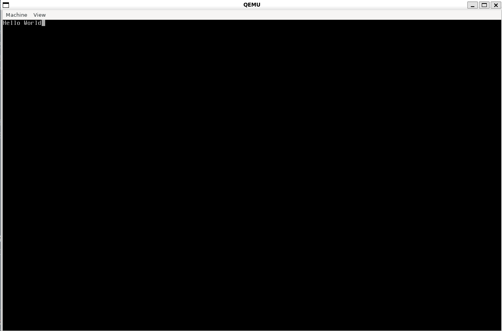

+++ 
author = "Liam Greenway" 
title = "Adding a terminal to our Limine C Kernel" 
date = "2025-04-12" 
description = "We add a terminal to our limine C Kernel, and change the build system to CMake" 
categories = [ "Beginner" ] 
tags = [ "c", "limine" ] 
+++

In this tutorial, we will be creating a simple kernel using the limine bootloader in C.
This tutorial assumes you are running on linux. This tutorial is a continuation of [a simple limine c kernel](../make-a-simple-x86_64-limine-kernel-in-c)

You will need the following things

- git
- xorriso
- Python 3.12
- make
- cmake
- qemu

You should know

- The C Programming Language
- The Python Programming Language
- How to use GCC
- How to use Git

To start, create the following directories

src/term
src/utils

Create the following files

src/term/term.c
src/term/term.h
src/utils/string.c
src/utils/string.h
src/boot.c
src/boot.h
build.py
CMakeLists.txt

Run the following command

```bash
git submodule add https://codeberg.org/mintsuki/flanterm src/term/flanterm
```

This will add [flanterm](https://codeberg.org/mintsuki/flanterm) to your project as a git submodule

go to `src/term/term.c` and add the following code

```c
#include "flanterm/flanterm.h"
#include "flanterm/backends/fb.h"
#include "../boot.h"
#include "../utils/string.h"
#include "./term.h"
```

This will include all the headers required for `term.c`

Next, add the flanterm context as a static global.

```c
static struct flanterm_context *context;
```

We can use the context after it is initialized to draw text to the screen.

Next, add this function

```c
void init_term(struct limine_framebuffer *framebuffer) {
    context = flanterm_fb_init(
        NULL, NULL,
        framebuffer->address, framebuffer->width, framebuffer->height, framebuffer->pitch,
        framebuffer->red_mask_size, framebuffer->red_mask_shift,
        framebuffer->green_mask_size, framebuffer->green_mask_shift,
        framebuffer->blue_mask_size, framebuffer->blue_mask_shift,
        NULL,
        NULL, NULL,
        NULL, NULL,
        NULL, NULL,
        NULL, 0, 0, 1,
        0, 0,
        0
    );
}
```

This initialiizes our context using the framebuffer provided by limine

Next, we add a function to write text

```c
void term_write(const char *c) {
    flanterm_write(context, c, strlen(c));
}
```

Now, open `src/term/term.h`

```c
#pragma once
#include <limine.h>

void init_term(struct limine_framebuffer *framebuffer);
void term_write(const char *c);
```

this tells the file including `term.h` what term.c contains (that is publicly accessable)

Now open `src/utils/string.c`

Add the following headers

```c
#include <stdint.h>
#include <stddef.h>
#include "string.h"
```

Now add this function

```c
size_t strlen(const char* str) {
    size_t len = 0;
    while (str[len])
        len++;
    return len;
}
```

`strlen` is used to get the length of a string at run time. this is also useful for printing strings.

Next, move the mem functions from `kmain.c` to this file as well

```c
void *memcpy(void *restrict dest, const void *restrict src, size_t n) {
    uint8_t *restrict pdest = (uint8_t *restrict)dest;
    const uint8_t *restrict psrc = (const uint8_t *restrict)src;

    for (size_t i = 0; i < n; i++) {
        pdest[i] = psrc[i];
    }

    return dest;
}

void *memset(void *s, int c, size_t n) {
    uint8_t *p = (uint8_t *)s;

    for (size_t i = 0; i < n; i++) {
        p[i] = (uint8_t)c;
    }

    return s;
}

void *memmove(void *dest, const void *src, size_t n) {
    uint8_t *pdest = (uint8_t *)dest;
    const uint8_t *psrc = (const uint8_t *)src;

    if (src > dest) {
        for (size_t i = 0; i < n; i++) {
            pdest[i] = psrc[i];
        }
    } else if (src < dest) {
        for (size_t i = n; i > 0; i--) {
            pdest[i-1] = psrc[i-1];
        }
    }

    return dest;
}

int memcmp(const void *s1, const void *s2, size_t n) {
    const uint8_t *p1 = (const uint8_t *)s1;
    const uint8_t *p2 = (const uint8_t *)s2;

    for (size_t i = 0; i < n; i++) {
        if (p1[i] != p2[i]) {
            return p1[i] < p2[i] ? -1 : 1;
        }
    }

    return 0;
}
```

Next, paste the following into `src/utils/string.h`

```c
#pragma once
#include <stddef.h>

size_t strlen(const char *c);

void *memcpy(void *restrict dest, const void *restrict src, size_t n);

void *memset(void *s, int c, size_t n);

void *memmove(void *dest, const void *src, size_t n);

int memcmp(const void *s1, const void *s2, size_t n);
```

Now, open `src/boot.c`

Paste the following

```c
#include "limine.h"
#include "boot.h"

__attribute__((used, section(".limine_requests")))
static volatile LIMINE_BASE_REVISION(3);

__attribute__((used, section(".limine_requests")))
volatile struct limine_framebuffer_request framebuffer_request = {
    .id = LIMINE_FRAMEBUFFER_REQUEST,
    .revision = 0
};

__attribute__((used, section(".limine_requests_start")))
static volatile LIMINE_REQUESTS_START_MARKER;

__attribute__((used, section(".limine_requests_end")))
static volatile LIMINE_REQUESTS_END_MARKER;
```

We have just moved the limine stuff to its own file.

Open `src/boot.h`

```c
#pragma once

#include "limine.h"

extern volatile struct limine_framebuffer_request framebuffer_request;
```

Now, open `src/kmain.c`

modify it to look like this

```c
#include <stdbool.h>
#include <stddef.h>
#include "limine.h"
#include "boot.h"
#include "term/term.h"

static void hcf() {
    for (;;) {
        asm ("hlt");
    }
}

void kmain() {
    if (framebuffer_request.response == NULL || framebuffer_request.response->framebuffer_count < 1) {
        // framebuffer not available — handle error
        while (1) { __asm__("hlt"); }
    }
    
    struct limine_framebuffer *fb = framebuffer_request.response->framebuffers[0];
    init_term(fb);
    
    term_write("Hello World");

    hcf();
}
```

now, open `CMakeLists.txt`

add your project definition

```c
project(kernel C)
```

set the C flags

```c
set(CMAKE_C_FLAGS "${CMAKE_C_FLAGS} -ffreestanding -Wall -Wextra -O2 -mcmodel=kernel -mgeneral-regs-only -mno-red-zone -mno-sse -mno-sse2 -mno-mmx -fno-omit-frame-pointer -mno-80387")
```

next, we tell cmake what our source files are

```c
set(SOURCES 
    src/kmain.c
    src/term/term.c
    src/boot.c
    src/term/flanterm/flanterm.c
    src/term/flanterm/backends/fb.c
    src/utils/string.c)
```

now, we tell cmake to use src as an include directory across all files (for easy access of `limine.h` and `boot.h`)

```c
include_directories(
    src
)
```

Next, we tell cmake to use our cross compiler

```c
set(CMAKE_C_COMPILER "x86_64-elf-gcc")
set(CMAKE_ASM_COMPILER "x86_64-elf-gcc")
set(CMAKE_ASM_COMPILER "x86_64-elf-ld")
```

Next, we tell cmake to use special linker flags, including our `linker.ld`

```c
set(CMAKE_EXE_LINKER_FLAGS "-T linker.ld -nostdlib -mcmodel=kernel")
```

Finally, we tell cmake to build our executable

```c
add_executable(kernel ${SOURCES})
```

Now we will create a python script to make it easier to run our kernel

open `build.py`

import the following modules

```py
import sys
import os
```

Add a main function

```py
def main():
    args = sys.argv
    if args[1] == "kernel":
        build_kernel()
    elif args[1] == "image":
        build_image()
    elif args[1] == "clean":
        clean()
    else:
        print("Usage: python build.py [kernel|image|clean]")
        sys.exit(1)
```

next, let's create our build_kernel function

```py
def build_kernel():
    print("Building kernel...")
    os.system("cmake . --toolchain x86_64.cmake")
    os.system("make -j" + str(os.cpu_count()))
```

now, we create our build_image function

```py
def build_image():
    print("Building image...")
    os.system("cmake .")
    os.system("make -j" + str(os.cpu_count()))
    if not os.path.exists("limine"):
        os.system("git clone https://github.com/limine-bootloader/limine --branch=v9.x-binary --depth=1")
    os.system("make -C limine -j" + str(os.cpu_count()))
    os.system("rm -rf iso_root")
    os.system("mkdir -p iso_root/boot")
    os.system("cp -v kernel iso_root/boot/")
    os.system("mkdir -p iso_root/boot/limine")
    os.system("cp -v limine.conf iso_root/boot/limine/")
    os.system("mkdir -p iso_root/EFI/BOOT")
    os.system("cp -v limine/limine-bios.sys limine/limine-bios-cd.bin limine/limine-uefi-cd.bin iso_root/boot/limine/")
    os.system("cp -v limine/BOOTX64.EFI iso_root/EFI/BOOT/")
    os.system("cp -v limine/BOOTIA32.EFI iso_root/EFI/BOOT/")
    os.system("xorriso -as mkisofs -R -r -J -b boot/limine/limine-bios-cd.bin \
        -no-emul-boot -boot-load-size 4 -boot-info-table -hfsplus \
        -apm-block-size 2048 --efi-boot boot/limine/limine-uefi-cd.bin \
        -efi-boot-part --efi-boot-image --protective-msdos-label \
        iso_root -o kernel.iso")
    os.system("./limine/limine bios-install kernel.iso")
```

next, create a clean function

```py
def clean():
    os.system("make clean")
    os.system("rm -rf kernel CmakeCache.txt cmake_install.cmake *.iso Makefile CMakeFiles iso_root limine build")
```

finally, call main

```py
if __name__ == "__main__":
    main()
```

that's all now run `python build.py image` and `qemu-system-x86_64 --cdrom kernel.iso`

You should get an output that looks like this



All code is available on GitHub at [this link](https://github.com/ApplePieCodes/limine-kernel-c-x86_64/tree/version-1).  

The repository contains the complete source code and files required to follow along with this tutorial.